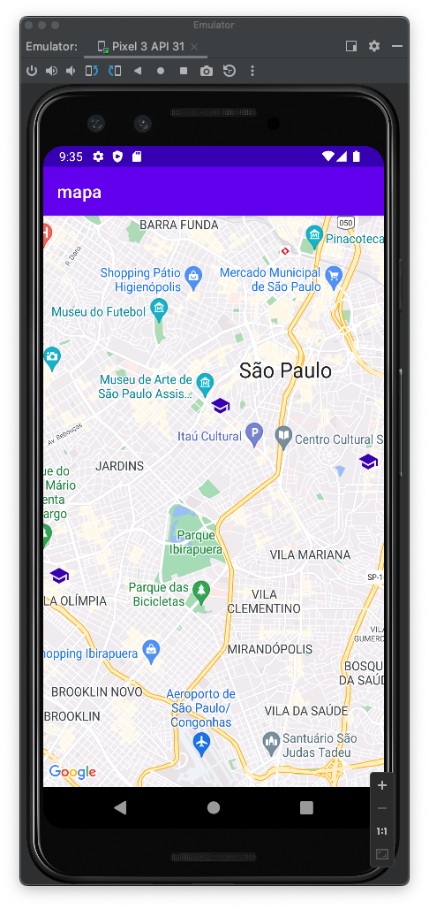

# mob-25-aplicacoes-android-aula6-map
# Introdução
Trabalhando com Mapas

# Ativdades
- Utilização de mapas com MapView;
- Localização do usuário com location API;
- Identificação de rotas;
- Marcaçao de pontos no mapa;

# Tela

# VersionCode: 1.0

# Authors
Danilo Santos
[@danilopsnts](https://www.linkedin.com/in/danilopsnts/)

